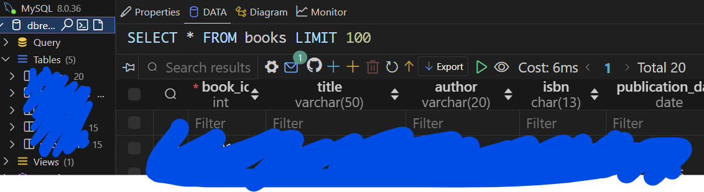
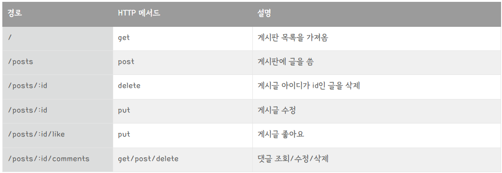
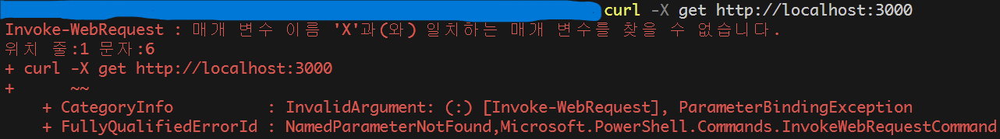
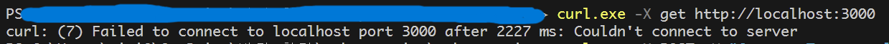

# powerBoost Study
## 이화여대 파워부스트 스터디

**********

## 1주차
### MySQL 데이터베이스 연결

**확장 프로그램 MySQL을 설치**하여 내가 미리 만들어놓은 데이터베이스와 연결함




**********

## 2주차
### 데이터베이스 사용하지 않는 간단한 게시판 만들기

express를 이용한 간단한 게시판을 만듦. 각 요청 테스트는 curl을 이용하여 진행함.



#### 새로 알게된 점
- express에서 원래의 정보를 변경할 때에 PUT 요청을 사용한다는 것을 새롭게 알게됨 (인수 : URL 패턴, 콜백 함수)

- `curl.exe -X` : curl 명령어에서 http 요청을 지정할 수 있도록 함

- 코드에 문제가 발생시 디버깅 코드를 사용하여 도움을 받을 수 있음
```javascript
app.use((req, res, next) => {
    console.log(`${req.method} ${req.url}`);
    next();
  });
```
이 코드를 사용하면 각 HTTP 요청이 서버에 도달했을 때 요청의 메서드와 URL이 콘솔에 출력되어 어떤 요청이 서버로 들어오고 있는지 확인하는 데에 용이함

#### 막혔던 부분
- curl 사용 익숙하지 않음 문제
    - 코드(서버)를 먼저 실행 후 curl 명령을 실행해야함. 그렇지 않으면 서버 연결 오류 문제 발생
    

    - vsCode에서 curl만 입력하면 오류가 뜸. 'curl.exe'로 실행해 주어야 함.
    
