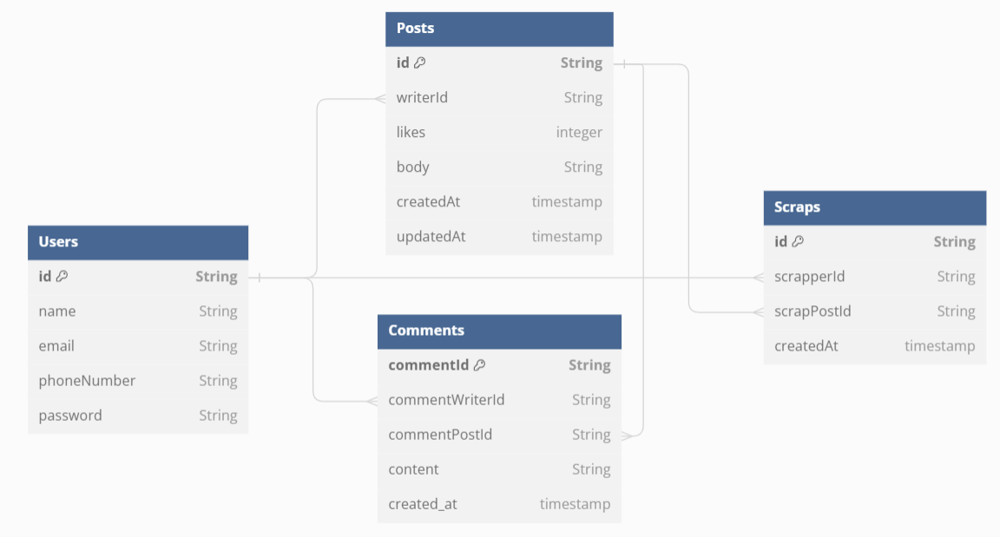

# powerBoost Study
## 이화여대 파워부스트 스터디

**********

## 1주차
### MySQL 데이터베이스 연결

**확장 프로그램 MySQL을 설치**하여 내가 미리 만들어놓은 데이터베이스와 연결함


**********

## 2주차
### 데이터베이스 사용하지 않는 간단한 게시판 만들기

express를 이용한 간단한 게시판을 만듦. 각 요청 테스트는 curl을 이용하여 진행함.


#### 새로 알게된 점
- express에서 원래의 정보를 변경할 때에 PUT 요청을 사용한다는 것을 새롭게 알게됨 (인수 : URL 패턴, 콜백 함수)

- `curl.exe -X` : curl 명령어에서 http 요청을 지정할 수 있도록 함

- 코드에 문제가 발생시 디버깅 코드를 사용하여 도움을 받을 수 있음
```javascript
app.use((req, res, next) => {
    console.log(`${req.method} ${req.url}`);
    next();
  });
```
이 코드를 사용하면 각 HTTP 요청이 서버에 도달했을 때 요청의 메서드와 URL이 콘솔에 출력되어 어떤 요청이 서버로 들어오고 있는지 확인하는 데에 용이함

#### 막혔던 부분
- curl 사용 익숙하지 않음 문제
    - 코드(서버)를 먼저 실행 후 curl 명령을 실행해야함. 그렇지 않으면 서버 연결 오류 문제 발생
    

    - vsCode에서 curl만 입력하면 오류가 뜸. 'curl.exe'로 실행해 주어야 함.
    

**********

## 3주차
### 데이터 베이스 사용하는 간단 게시판 만들기

mysql과 prisma를 사용하여 데이터베이스를 사용하는 게시판 만들기를 수행함

- ERD 모델
  


#### database
-  Users


-  Posts


-  Comments


- Scraps


#### 새로 알게된 점 
-  `"type": "module"` 속성이 있으면 Node.js는 해당 프로젝트 파일을 ES 모듈로 처리함. 이에 따라서 require문도 사용 불가

#### 막혔던 부분
- 사용자들의 암호를 bcrypt을 이용하여 암호화를 수행하다가 이미 시딩된 정보들은 암호화가 되어있지 않아서 이를 암호화하다 오류발생... ☞ 오류해결하지 못해서 다시 암호화 이전으로 돌림

-  의도되지 않은 프로퍼티 사용됨 에러
스키마에서 Users 로 정의했기 때문에 users로 받아야 undefined 에러가 발생하지 않는다. user로 되어있어서 계속 에러가 뜸. 프리즈마 모델 이름은 보통 단수를 사용한다고 한다. 알아두자.


-  http 요청 과정에서 header관련 에러 발생

http 요청 과정에서 헤더와 본문 사이에 빈줄이 한 줄 존재해야함


#### 더보기
- http 요청 처리는 보통 `postman`을 많이 이용한다고 한다. 다음부터는 restClient 보다는이를 이용해서 해봐야겠다. 
- prisma는 비관계형 데이터베이스인 mongoDB에 최적화되어있는 ORM이라고 한다. 관계형 데이터 베이스에 맞는 걸로 사용해보자.
- 커밋 메세지도 정해진 방법이 있다고 하는 데 이에 맞춰서 작성하도록 해보자.
- 좋아요 기능도 다시 만들어 보자.
